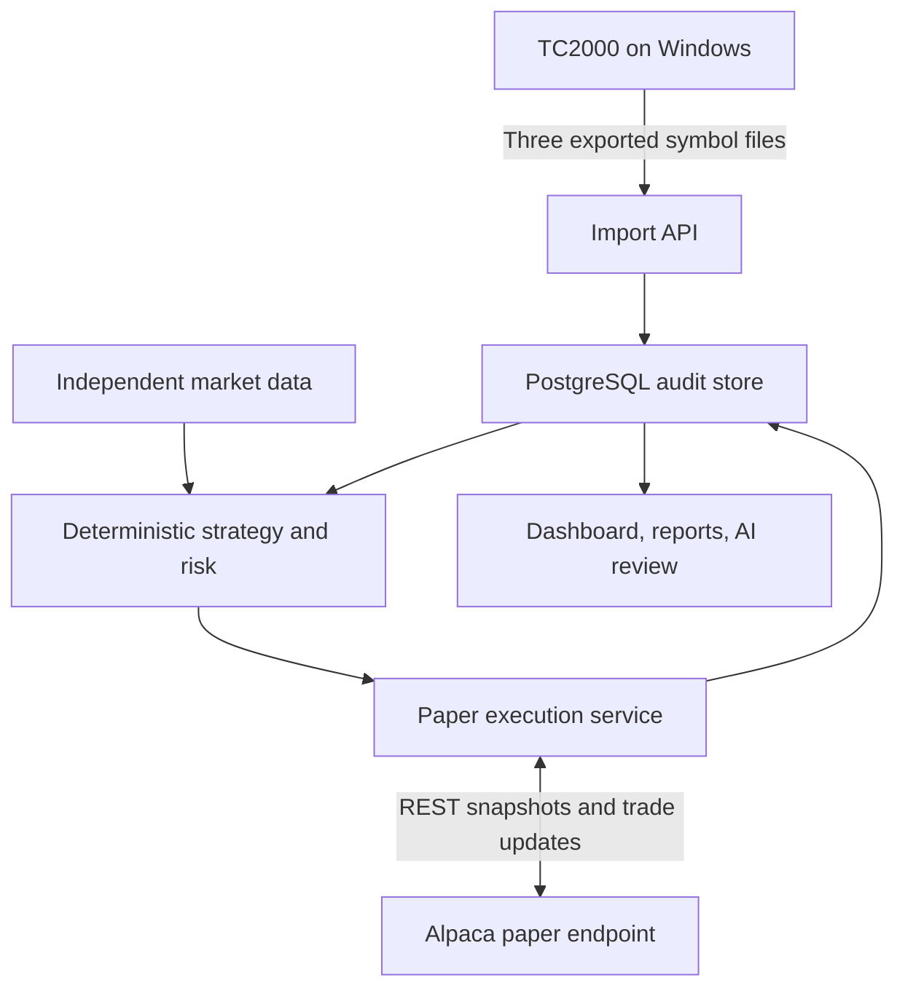

# Architecture

## Trust boundaries

Only the paper execution service receives the broker order-mutation interface. The import API, Windows companion, dashboard, reporting, and AI review code receive no broker write capability.

## Component contracts

| Component | Owns | May depend on | Cannot do |
|---|---|---|---|
| `tc2000.importer` | Atomic batch validation, raw hashes, memberships | storage, calendar, symbol policy | Fetch scans or place orders |
| `data` | Bars, quotes, feeds, corporate actions, freshness | provider adapters, storage | Promote candidates |
| `scanner` | Strength, trend, contraction, breakout calculations | immutable data snapshots and config | Mutate orders |
| `strategy` | Trade-case model and guarded transitions | scanner evidence, state store | Call broker directly |
| `risk` | Sizing, committed risk, exposure, buying-power caps | reconciled broker read model | Relax configured caps |
| `execution` | Durable order intents and paper order mutations | risk decision, state machine, broker adapter | Operate before readiness |
| `broker.alpaca_paper` | Paper REST and stream protocols, endpoint/account verification | HTTP/WebSocket clients | Accept configurable live host |
| `reconciliation` | Broker/local comparison, incidents, recovery gates | broker read protocol, storage | Hide or auto-dismiss mismatch |
| `reporting` | Daily/weekly metrics and limitations | immutable/read projections | Become a decision dependency |
| `ai_review` | Explanations, clustering, anomaly drafts | redacted immutable records | Reach strategy/risk/execution interfaces |
| `api` | Authenticated dashboard, atomic upload, emergency entry block | application services/read models | Bypass state guards |
| Windows companion | Auditable folder watch and authenticated batch forward | import endpoint only | Store broker credentials or automate TC2000 UI |

## Event flow

1. The operator exports and submits all three TC2000 files as one batch.
2. One database transaction preserves raw bytes and hashes, validates completeness/date/symbols, and derives 3-of-3, 2-of-3, and union sets.
3. The validator fetches independent point-in-time data, stores provenance, and writes component-level rule results against one configuration hash.
4. Only strict 3-of-3 candidates can become `SETUP_WATCH`. Shadow memberships are never mapped to an executable intent.
5. During regular hours, a breakout event is evaluated against freshness, time-normalized volume, spread, chase, liquidity, session, reconciliation, and portfolio risk.
6. Risk reservation, order intent, and `ENTRY_PENDING` transition commit atomically. The broker call follows the commit.
7. REST and stream events update broker projections. Fills trigger immediate stop protection and global entry blocking until the stop is acknowledged.
8. A durable one-time 5R action sells the rounded partial. Confirmed partial fill precedes breakeven-stop replacement.
9. A completed official daily close below SMA10 creates a next-session final-exit intent while the protective stop remains active.
10. Continuous and startup reconciliation compare broker facts to local projections. Readiness remains false while material discrepancies exist.

## Consistency model

- External calls never occur inside a database transaction.
- Order intents, risk reservations, and transition events commit before submission.
- Retries use the same deterministic `client_order_id` and reconcile before resubmission.
- Broker events deduplicate on provider event ID, with payload-hash fallback.
- Trade-case updates use optimistic aggregate versions or serializable transactions.
- Broker position/order facts are authoritative. Local history is append-only and discrepancies create incidents.
- Import activation is atomic. A rejected or partial batch produces no active candidate set.
- Readiness requires database access, paper verification, fresh broker snapshots, reconciled positions/orders, and valid protection for every open position.

## Paper-only enforcement

- The Alpaca trading host is a compile-time constant allowlist containing only `https://paper-api.alpaca.markets`.
- Configuration contains credentials but no broker-host option and no live/paper selector.
- Startup verifies URL scheme/host, paper account identity, clock, and permissions before constructing the mutation client.
- Every mutation method rechecks the verified adapter state.
- A boundary failure exits safely and emits no network request to an unapproved host.
- CI and tests use fakes. Opt-in sandbox tests require protected Alpaca paper credentials and never run for fork pull requests.

Official references: [Alpaca paper behavior and limitations](https://docs.alpaca.markets/docs/paper-trading), [Alpaca order behavior](https://docs.alpaca.markets/docs/orders-at-alpaca).
