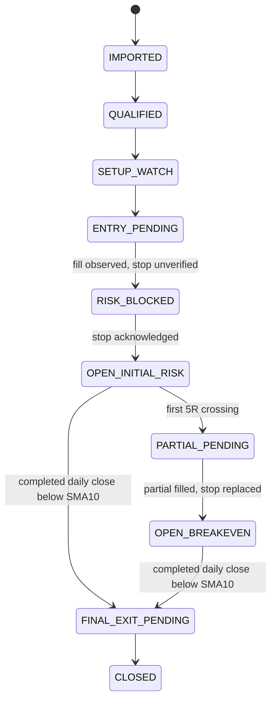

# Guarded Trade State Machine

Each transition is append-only and contains `trade_case_id`, `from_state`, `to_state`, `event_id`, `idempotency_key`, `aggregate_version`, `config_hash`, `occurred_at`, guard results, and a reason.

## Normal lifecycle

An entry fill always passes through `RISK_BLOCKED` until the protective stop is acknowledged. This deliberately exposes the protection gap and blocks new entries during it.

## Transition guards

| From | To | Required guards | Idempotency |
|---|---|---|---|
| none | `IMPORTED` | Complete atomic three-file batch; valid market date, filenames, symbols, hashes, freshness | Unique batch hash |
| `IMPORTED` | `QUALIFIED` | Strict membership; complete independent bars; stored feed/timestamps; required deterministic rules pass | Batch + symbol + config + data snapshot |
| `QUALIFIED` | `SETUP_WATCH` | Contraction valid; breakout level frozen from available completed bars | Evaluation ID |
| `SETUP_WATCH` | `ENTRY_PENDING` | Fresh crossing; regular session; volume/spread/chase/liquidity pass; risk and reconciliation clear; no symbol exposure | Unique entry intent and client order ID |
| `ENTRY_PENDING` | `RISK_BLOCKED` | Broker-confirmed fill quantity greater than zero and no acknowledged valid stop yet | Fill event ID |
| `RISK_BLOCKED` | `OPEN_INITIAL_RISK` | Broker acknowledges stop covering reconciled open quantity | Stop order ID + protected quantity |
| `OPEN_INITIAL_RISK` | `PARTIAL_PENDING` | First price event at or above actual VWAP entry + 5R; rounded quantity is valid | Unique `(trade_case, five_r_partial)` action |
| `PARTIAL_PENDING` | `OPEN_BREAKEVEN` | Partial fill reconciled; replacement stop acknowledged at actual VWAP for remaining quantity | Partial action + replacement version |
| Open state | `FINAL_EXIT_PENDING` | Official completed daily bar close below its SMA10; next supported session identified | Signal bar timestamp |
| Any risk-bearing state | `CLOSED` | Broker position zero; fills and conflicting open orders reconciled | Closing broker snapshot hash |

## Failure transitions

| Trigger | State/effect | Recovery rule |
|---|---|---|
| Entry TTL, chase, setup, freshness, or session failure before fill | `INVALIDATED`; cancel intent if needed | Cancellation must be broker-confirmed before closing case |
| Missing, rejected, undersized, or uncertain stop | `RISK_BLOCKED`; global new-entry block | One bounded recovery action per durable recovery key, then operator incident |
| REST/stream disagreement, unknown order, quantity mismatch, stale broker snapshot | `RECON_BLOCKED`; global new-entry block | REST snapshot plus event replay; never erase incident history |
| Persistence failure before intent commit | No broker call; readiness false | Restore persistence, then reconcile |
| Timeout after submission | Keep `ENTRY_PENDING`; do not create a new ID | Query by client order ID and reconcile before retry |
| Stop fills during partial/final exit | Remain blocked until broker quantity and all exit orders reconcile | Resize/cancel only through guarded recovery intent |

## Exactly-once 5R behavior

The unique partial-action key is inserted in the same transaction as `PARTIAL_PENDING`. Duplicate price events return the existing action. After a crash, the service reconciles broker orders and fills using the same client order ID before it can submit or advance. A partial fill protects the remaining reconciled quantity. Breakeven replacement occurs only after the partial fill is confirmed.

## Restart

1. Start in not-ready and block new entries.
2. Load durable intents, transitions, and unresolved incidents.
3. Fetch paper account, positions, open orders, and recent fills.
4. Replay deduplicated trade updates after the last checkpoint.
5. Project broker-authoritative actual state without deleting local history.
6. Verify every open quantity has a valid stop or actively managed final exit.
7. Remain `RECON_BLOCKED` or `RISK_BLOCKED` until discrepancies are resolved.
8. Report ready only after all fail-closed gates pass.
